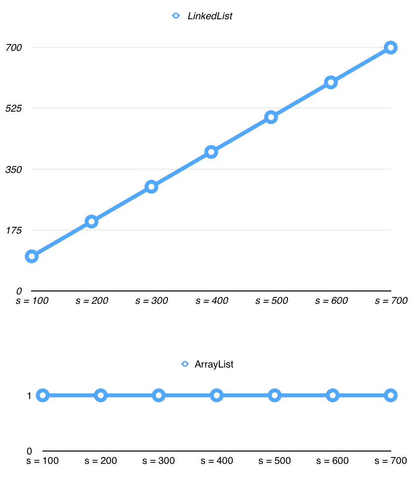
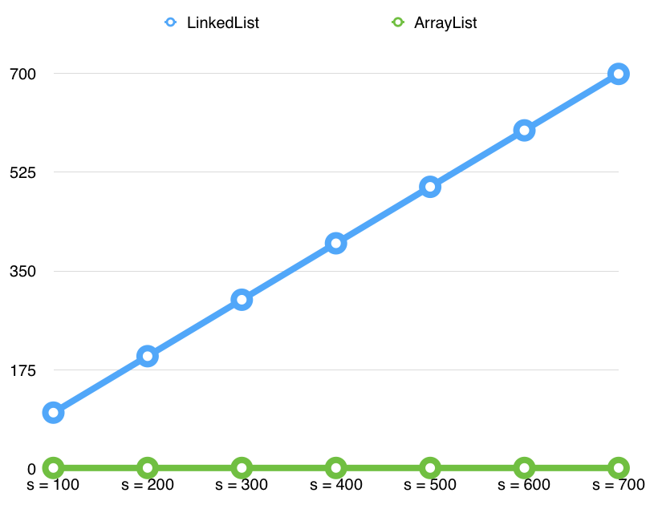

# Data Structures: Lists

In this unit we'll be studying two classic data structures. In the course of the unit you will:

 * Build an **ArrayList** (a.k.a _Dynamic Array_) data structure from scratch
 * Build a **LinkedList** data structure from scratch
 * Compare the **performance** of these List implementations
 * Express the performance of individual List operations in **Big-O** notation

But before we begin, we need to talk about arrays.

## The Humble Array

As programmers we use Ruby's Array a lot, so much so that it's easy to take it for granted. In truth, there's a lot going on behind the scenes to make adding, removing, changing and finding elements in a Ruby array so easy. Many of the operations we take for granted on Ruby's Array class aren't nearly as simple as you may think!

## "Real" Arrays
At a low level, when a program in any language wants to store something, it has to ask the operating system for a piece of memory. In making the request, the program also has to tell the operating system how _much_ memory it wants. If the program wants to store a collection of 8 things, it has to ask the OS for a piece of memory big enough to fit all 8 items up front.

In lower level languages like C, arrays are fixed in size because they really are just chunks of memory. You can say "I want an array of 8 things" and that's what you'll get. You can't add a 9th thing onto the array and expect it to grow because you only asked the OS for a chunk of memory that will fit 8 things. In other words, a true array is *fixed in size*.

What Ruby _calls_ an Array isn't actually a true Array, instead it's a class that obscures a collection of behaviors that hide all this memory allocation business from you. Ruby arrays actually use these C-style "fixed" arrays underneath, but so far you've never had to worry about it.

You might be wondering, if Ruby has to use a fixed-size array underneath, how are Ruby arrays able to grow? If arrays are truly fixed in size, how is it possible that Ruby's Array class seems to grow indefinitely, with no concern for the idea of a fixed capacity? In the first challenge of this unit, you'll be figuring that out for yourself!

## The "List" Data Structure
We're going to be studying two interesting data structures in this unit, and both are types of Lists. Typically the study of data structures does not assume you're in a user-friendly, high-level language like Ruby. In fact, the data structures we'll be studying assume you're working at a low-level, including the limitation that your arrays are _fixed_. We may be in Ruby, but to really understand these data structures we're going to pretend we don't have Ruby's standard Array, and instead only have fixed-size arrays.

You've been provided with a class called `FixedArray` in `lib/fixed_array.rb`. FixedArray emulates in Ruby what a "true" array is like under the hood. In these challenges you are free to use FixedArray objects, but you cannot use Ruby's standard array (`[]`). You also aren't allowed to use Hash or Set.

## Abstract Data Types

In computer science we have the idea of "abstract data types" (ADTs). An abstract data type has certain characteristics and behaviors, but provides no details on _how_ it should actually be implemented. You can think of an abstract data type as a contract that specifies the _what_ but not the _how_.

For example, a simple Stack ADT contract might say: "If you support `push` and `pop` operations you can call yourself a Stack — I don't really care how you do it, but those methods better work!"

In this unit we're going to be working with the abstract data type known as a "List". We're going to implement a List two different ways, but both our implementations will have the same methods. Both will be able to add and retrieve elements, for example, because that's part of the List contract.

Additionally, there's a very important property of a List that interests us. A List data structure must be able to _grow indefinitely._ Unlike "true" arrays, which are fixed in size, a List is something that should be able to grow to fit the data we're inserting into it.

When we're done creating our two different implementations of the List ADT we'll compare and contrast how one implementation of a List performs against another. This will be our opportunity to talk a little bit about the idea of "Big-O" notation.

If this feels overwhelming don't worry, keep working through this challenge, but return to this README and read this introduction section periodically as you work. We're going to jump into coding soon.

## Release 0: FixedArray

Before you begin, familiarize yourself with the FixedArray class and its specs. You might load it up in IRB or a runner file to play around with it:

```
$ irb -r./lib/fixed_array.rb
```

We won't be using Ruby's Array in this unit, instead we'll be using FixedArray, so get to know it!

## Release 1: Array List

It's time to get started and implement our first class that conforms to the List abstract data type. We'll be implementing the _ArrayList_ — you can find the details of the ArrayList challenge in [array_list.md](array_list.md).

## Release 2: Linked List

Now it's time to create our second implementation of a List. We're going to take a very different approach and build a _LinkedList_. Since it is a concrete implementation of the List abstract data type, LinkedLists must also grow dynamically as new elements are added.

Unlike the `ArrayList`, our `LinkedList` will not use a `FixedArray` or normal Array at all! A `LinkedList` conforms to the same List "contract" as `ArrayList`, but behind the scenes it works very differently.

You'll find the details in [linked_list.md](linked_list.md).

## Release 3: Analyzing Performance

In this repository you'll find a branch called `reference-implementation`. Check out that branch now.

### Reference Implementations

You'll find reference implementations of ArrayList and LinkedList in their respective files in `lib`. Compare your solution against these. What do you notice? Are the two implementations similar? If they differ, how do they differ? Even if your solution doesn't look like the reference implementation we've provided, chances are they're pretty similar.

Spend some time familiarizing yourself with this code and understanding what it's doing. We'll be analyzing its performance in the next section, so understanding the reference code is crucial.


_Editor's Note: We're pretty sure these reference solutions are correct, but if you think you've found a bug drop a line to matt@devbootcamp.com!_

### Tracking Operations

As alluded to earlier, LinkedLists and ArrayLists may have identical actions, but the performance of those actions can differ wildly. For example, both data structures can insert values at the beginning of a list, but one of them is much more efficient than the other.

To explore this, some tracking has been applied to key methods in `Node` and `FixedArray`. You don't need to do anything to them yourself, but they are set up to allow us to examine how many operations are required by ArrayList and LinkedList to accomplish certain goals. As your code runs, the `Reporter` module in `lib` will count the number of times certain methods are run on `Node` and `FixedArray`. This will make it easy to see how our data structures differ as they go about their tasks.

Let's give this a test. Create a Ruby file and name it `report-example.rb`. Make sure you require `lib/array_list.rb`, `lib/linked_list.rb` and `lib/reporter.rb`.

The `Reporter::report_on` method takes a block. Code you write in that block will be tracked, and a short report will be printed after the block runs detailing what kind of operations occurred behind the scenes in the course of running your code.

As an example, let's see how the performance of `#get` differs between ArrayList and LinkedList.

```ruby
require_relative 'lib/array_list.rb'
require_relative 'lib/linked_list.rb'
require_relative 'lib/reporter.rb'

# Create two 100 element lists
test_ll = LinkedList.new
test_al = ArrayList.new
100.times do
  test_ll.add("test item")
  test_al.add("test item")
end

# Get a report on what happens when we access the last item in our LinkedList
Reporter.report_on("Accessing the last element in our LinkedList") do
  test_ll.last
end

# Get a report on what happens when we access the last item in our ArrayList
Reporter.report_on("Accessing the last element in our ArrayList") do
  test_al.last
end
```

You should see output that looks something like this:

```text
Report for "Accessing the last element in our LinkedList"
=========================================================
  Node#next: 99 operations
  Node#element: 1 operations
  Total Operations: 100

Report for "Accessing the last element in our ArrayList"
========================================================
  FixedArray#get: 1 operations
  Total Operations: 1


```

It looks like LinkedList needed 100 total operations to find the last element. If you think about how Linked Lists work, this makes sense — our code started at the first node in the list and had to follow 99 `#next` pointers to find the last node at position 99, then it used one `#element` operation to actually read the contents of that node.

Meanwhile, our ArrayList was able to look up the value at position 99 directly by accessing the FixedArray it uses underneath. Asking a FixedArray for something at a given position is only a single operation, so an ArrayList was able to accomplish this task in 1 operation.

Both accomplish the same goal, but as you can see the LinkedList appears to be less efficient.

Now it's your turn to perform some analyis. Run the example code above, but change the length of the list and see how the total number of operations change as the size of the list increases. For example, you might try list lengths of size 100, 200, 300, 400, 500 and 600.

With that data in hand, use a spreadsheet to plot the total number of operations against the size of the list.

| Data Structure  | List Size 100 | List Size 200 | List Size 300 | ... |
| --------------- | ------------- | ------------- | ------------- | --- |
| LinkedList      | 99            |       ?       |       ?       | ... |
| ArrayList       | 1             |       ?       |       ?       | ... |

Finally, use your spreadsheet program to create 3 line chart plots. One plotting the LinkedList against the list size, one plotting the ArrayList against the list size, and a third with both data structures plotted on the same graph so we can compare and contrast the two.

When you're done, you should have something that looks like this:




### Big-O

As we analyze the performance of `#last`, the thing to pay attention to is not actually the number of operations, it's how that number of operations _changes_ as the list grows. In the case of the LinkedList, the number of operations run by `#last` increases as the size of the list increases. Also notice that it grows steadily in a straight, linear line.

ArrayList is another story. It doesn't matter how many things are in the list, it always takes the same amount of time. Since we're curious about growth, we don't care if `ArrayList#last` takes one operation or ten operations, what's interesting is that it always takes the _same number_ of operations no matter how big the list is. In other words, the number of operations required by `ArrayList#last` stays constant as the list grows.

It turns out there's language to describe the patterns we're seeing, it's known as "Big-O notation". Analyzing the "Big-O" of an algorithm is all about determining how the operations required by that algorithm will increase as the algorithm operates on larger and larger input.

When we look at Big-O, we don't worry about precisely how many operations are required when running an algorithm with a single input. When you hear "Big-O", think "Big Picture" — we're not worried about the specific operation count, we're interested in how that operation count _grows_ over time. That's why we had to run `#last` with different list sizes, it allowed us to see the big picture — how `#last` performed in each implementation as the lists got bigger.

_Note: It's highly encouraged that you go do a little reading on Big-O at some point during or after this unit. Don't rely on this challenge to give you everything you need!_

Now that we have a sense of what Big-O is for, let's look at some common Big-O terms:

#### O(1)

An algorithm that is "O of 1" is known as _constant time_. No matter how big the thing that algorithm is working with gets, it will always take the same amount of time.

In our analysis above we found that `ArrayList#last` is a constant time operation. This terminology is useful, because now we can say "`ArrayList#last` is O(1)" and other people will know immediately that `last` always takes the same amount of time no matter how big the list is.

#### O(n)
An algorithm that is "O of n" performs in _linear time_. As the size of the input increases, the time required to process that input increases with it. Crucially, the time required to process inputs always grows at the same rate, which is why O(n) algorithms yield a straight line up and to the right when we visualize them.

In our analysis we found that `LinkedList#last` is O(n). Again, this short-hand is useful. If I tell you "`LinkedList#last` is O(n)" you now know that `#last` will slow down at a linear rate as the size of the LinkedList increases.

Here's a plot of some common Big-O terms to help you visualize, we'll talk about a couple more of these later.


### Analyzing Our Lists

Now that we've dipped our toes in the Big-O analysis process, it's time to dive in head first.

For each of the scenarios below, do the following:

  * Read the scenario to make sure you understand what you're analyzing.
  * Look at the code in the reference implementation that this scenario will "exercise.""
  * Decide what you thing the Big-O of the method being tested is, and why, _before_ you run any code.
  * Write some test code to actually measure the operation counts in the scenario, and plot those counts on a graph like we did with `#last`. Do your results match your Big-O analysis in the previous step?

An example of test code measuring `#last` is available in `analysis-example.rb`.

Here are the scenarios:

#### Insert at the front

Insert a value at the _front_ of a list. Test this on many different sizes of lists. What is the Big-O of `ArrayList#insert` when inserting at the front of the list? What about `LinkedList#insert`?

Do they differ? If so, why?

#### Insert into the middle

Insert in element in the _middle_ of a list. Test this on many different sizes of lists. What is the Big-O of `ArrayList#insert` when inserting in the middle of a list? What about `LinkedList#insert`?

Do they differ? If so, why?

#### Add an element to the end

Add an element to the end of a list (`#add`). Test this on many different sizes of lists. What is the Big-O of `ArrayList#add`? And `LinkedList#add`?

Do they differ? If so, why?

#### Get the first element of a list

Retrieve the first element of a list (`#first`). Test this on many different sizes of lists. What is the Big-O of `ArrayList#first`? `LinkedList#first`?

Do they differ? If so, why?

#### Set the first element of a list

Create a list, then `#set` the first element of it to something different. Test this on many different sizes of lists. What is the Big-O of `Arraylist#set` and `LinkedList#set` when setting the first element of a list?

#### Set the middle element of a list

Create a list, then `#set` the middle element in it to something different. Test this on many different sizes of lists. What is the Big-O of `Arraylist#set` and `LinkedList#set` when setting the _middle_ element of a list?

#### Examine Growth

Create an empty list. Grow the list to size 32 using `#add`. Everytime you add, use `report_on` to see how many operations that single call to `#add` resulted in.

As the size of the list grew, how does `#add` perform? Do you notice anything strange?

Plot the results. Describe what you see, and why you think it looks the way it does.

### Reference Analysis

When you are finished, you can check your work against the reference PDF in `assets/analysis-reference.pdf`.

### A couple more Big-O terms

To keep us focused, we didn't get into O(n^2) or O(log n) as we analyzed our Lists because our list operations didn't exhibit these characteristics. However, these are important Big-O terms, so read on.


#### O(n^2)
An algorithm that is "O of n squared" experiences operation growth that accelerates over time. An O(n^2) method might mean a list of 2 would take 4 operations, a list of 3 would take 9 operations, and a list of 4 would take 16 operations. Notice that the operation count is not increasing linearly, it's accelerating.

Visually O(n^2) algorithms increase on a curve, unlike the linear progression of O(n)

A simple example of an O(n^2) algorithm is a nested loop like this:

```text
# pseudocode

define loop_the_loop(size) {
  for i in range 0..size {
    for j in range 0..size {
      print i , j
    }
  }
}

loop_the_loop(5)
```

In the pseudocode above, each iteration of the outer loop will in turn trigger 5 iterations of the inner loop. This means `print` will run 25 times. With an input of 6 it would print 36 times, with 7 it would run 49 times, and so on.

##### Try it out

Consider adding a "combinations" method to ArrayList that finds all the different pairs of items within the list and prints them as they're discovered. Plot the results and graph it — what do you see?

#### O(log n)

An algorithm that is "O of log n" also does not increase linearly. You can think of it as the mirror image of O(n^2). As the size of the input grows, an O(log n) algorithm takes progressively longer, but the amount by which the operation count grows with each input actually slows down over time. If that sounds weird, that's ok. Of the standard set of "Big-O" terms, O(log n) is the least intuitive for many people.

Let's try to look at O(log n) in more concrete terms. Many "divide an conquer" algorithms, for example Binary Search, are O(log n). You can actually prove this to yourself right now. Feel free to go refresh your memory on how binary search works at a high level.

Now, draw out a series of balanced binary trees, each bigger than the last. Figure out for yourself how many decisions a binary search would need to make to find an element at the bottom of each tree (remember, at each "node" in a tree, a binary search decides if it should keep searching _left_ or _right_ in the tree, ignoring the other piece of the tree at every step).

Plot the number of decisions required against the size of each tree, much the same as you did in analyzing our lists. Do you see the picture that emerges? It should look something like the O(log n) curve in the image above.

## Conclusion

Congratulations, you've waded deep into some classic computer science topics. The ability to recognize the characteristics of the classic data structures underlying the tools you use everyday is a valuable one. You've been exposed to the List abstract data type, and now you can continue your studies by examining Sets, Maps, Graphs and Trees next. All of these ADTs have classic concrete implementations as well. For example, Sets have the Hash Set and Maps have the Hash Table. Even if you don't implement them or even fully understand them, it pays to know the Big-O of their operations. It will allow you to make informed decisions about your data structures when performance is a concern.

The Big-O analysis experience you've picked up will serve you in your own code too. As you build systems, you'll be able to read through your code and recognize when you're building methods that are O(1), O(n), O(n^2) or something else entirely. Performance issues might not occur every day in your work as a programmer, but when they do you'll be better equipped to reason about them.
